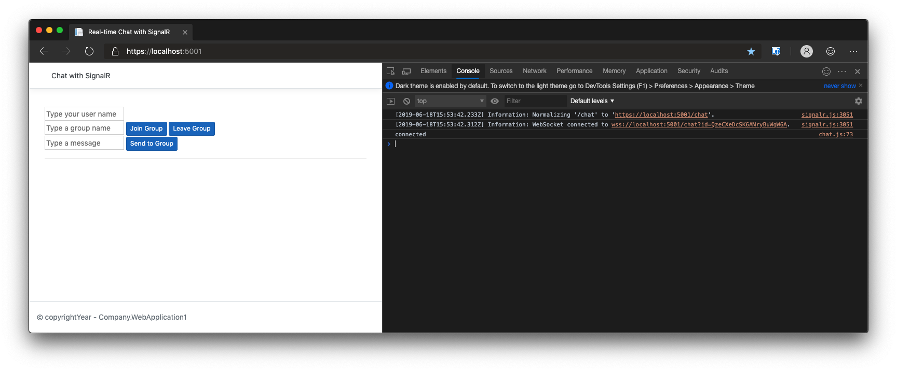
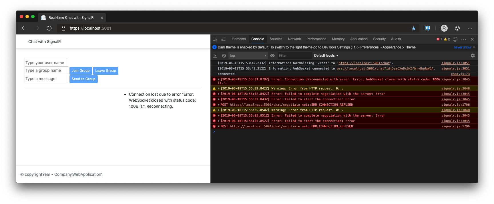
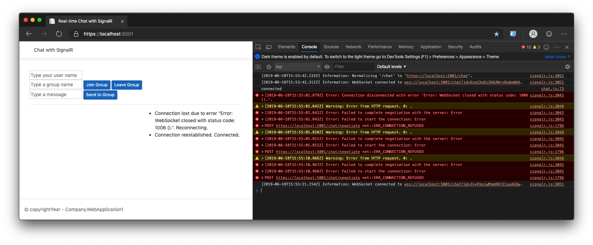

# SignalR Automatic Reconnection Demo

This demo provides   easy way to show the new `withAutomaticReconnect`, `onreconnected`, and `onreconnecting` functionality resident in the 3.0 preview 6 release. Here are the steps to run the demo:

1. Clone this repository.

1. Open `wwwroot\js\chat.js`. The first few bits of code demonstrate how to enable automatic reconnection and how to handle events related to reconnects.

1. Speak to the new `withAutomaticReconnect` method, and make sure to point out that its behavior can be customized by providing an array of millisecond values the client should wait to reconnect.

    ```javascript
    var connection = new signalR.HubConnectionBuilder()
        .withUrl("/chat")
        .withAutomaticReconnect([0, 3000, 5000, 10000, 15000, 30000])
        //.withAutomaticReconnect([0, 2000, 10000, 30000]) yields the default behavior
        .build();
    ```

1. Speak to the `onreconnecting` handler and how it enables developers to update their UI when the app is trying to reconnect.

    ```javascript
    connection.onreconnecting((error) => {
        disableUi(true);
        const li = document.createElement("li");
        li.textContent = `Connection lost due to error "${error}". Reconnecting.`;
        document.getElementById("messagesList").appendChild(li);
    });
    ```

1. Speak to the `onreconnected` handler and how it gives developers a place to update their UI once the app has successfully reconnected.

    ```javascript
    connection.onreconnected((connectionId) => {
        disableUi(false);
        const li = document.createElement("li");
        li.textContent = `Connection reestablished. Connected.`;
        document.getElementById("messagesList").appendChild(li);
    });
    ```

1. Make sure to mention that the automatic reconnection is available today via `npm install @aspnet/signalr@next`.

1. Run `dotnet run` in the directory with the app.

1. Open the site in the browser at https://localhost:5001.

1. Open the debugging tools and call out how the connection has been established.

    

1. Stop the app from running (either via `Ctrl-C` or stop the debugger). Flip back to the browser to show how the client has been disconnected.

    

1. Restart the app and flip back to the browser window - don't refresh it - and wait until the client reconnects. Note, you may need to tune your values passed to `withAutomaticReconnect` depending on your own pace.

    

1. Mention that the docs are available for the preview at https://aka.ms/signalr/auto-reconnect.

